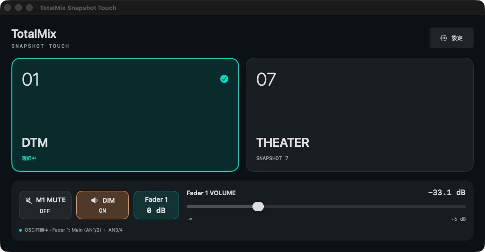
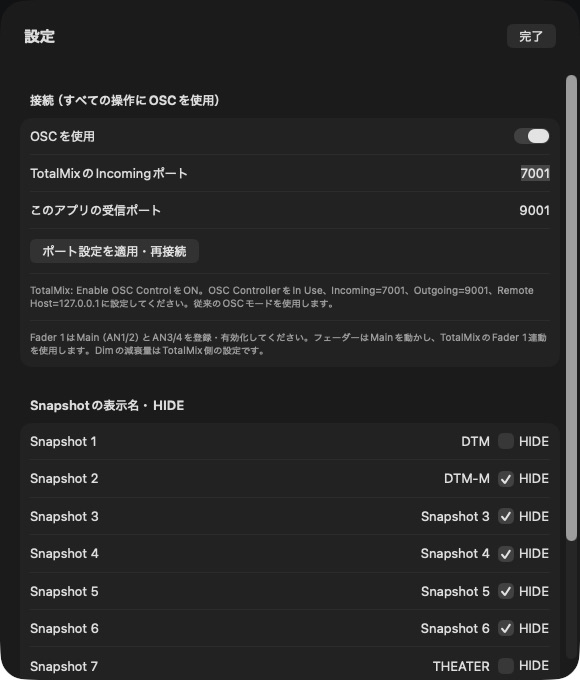
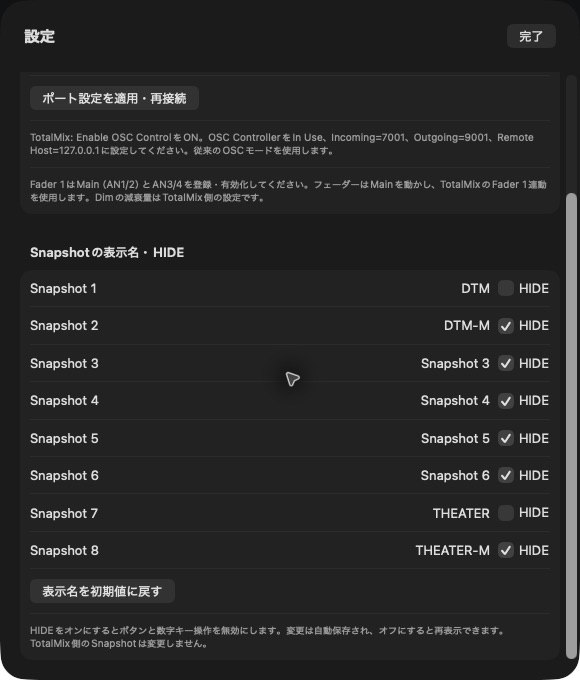

# TotalMix Snapshot Touch

RME TotalMix FXを、大きなボタンとフェーダーで操作するmacOSアプリです。OpenDisplayでMacの外部ディスプレイにしたiPadからのタッチ操作を主な用途としています。



*表示名を変更し、Snapshot 1と7だけを表示した例。緑の枠とチェックはTotalMixから取得した現在の選択です。初期状態では1〜8をすべて表示します。*

## できること

| 操作 | 動作 |
| --- | --- |
| Snapshot 1〜8 | 保存済みSnapshotを呼び出す。数字キー`1`〜`8`にも対応 |
| 表示名・HIDE | Snapshotの名前変更と非表示。設定は再起動後も保持 |
| M1 MUTE | TotalMixのMute Group 1をON/OFF |
| DIM | Control RoomのDimをON/OFF |
| Fader 1 0 dB | Mainを0 dBに設定し、F1内の音量差を維持して連動 |
| Fader 1 VOLUME | MainとAN3/4を、TotalMixのF1グループで連動操作 |

ウインドウはサイズ変更・フルスクリーンに対応します。Snapshotは横長で最大4列、縦長で最大2列となり、表示数に合わせてボタンのサイズを調整します。小さなウインドウではスクロールできます。

## 動作環境と起動

- macOS 13以降
- RME TotalMix FXと対応オーディオインターフェース
- ソースからビルドする場合はXcode
- iPadで操作する場合は、OpenDisplayなどでタッチをMacのクリックとして渡せる環境

検証環境はApple Silicon Mac、Xcode 26.6、TotalMix FX 2.01、Fireface UCX IIです。Intel Macでの実機動作は未確認です。

### ビルド・起動

```sh
make run
```

ビルドだけなら`make build`。Finderから`launch.command`を開いてもビルド・起動できます。Xcodeでは`TotalMixSnapshotTouch.xcodeproj`を開き、`TotalMixSnapshotTouch` schemeを実行してください。

生成先：

```text
build/Build/Products/Release/TotalMixSnapshotTouch.app
```

生成された`.app`を丸ごとコピーすれば、ソースやビルドフォルダを同梱せずに使えます。同じMac内で移動しても設定は保持されます。別のMacではCPUアーキテクチャの適合に加え、下記のTotalMix OSC設定が必要です。設定データは自動では移りません。

アプリはローカル実行用のアドホック署名です。Developer ID署名・公証は行っていないため、別のMacへの配布ではGatekeeperにより起動が制限されることがあります。

## セットアップ

すべての操作を同じMac内のOSC（UDP、`127.0.0.1`）で行います。IACバスやMIDI設定は不要です。外部ライブラリやインターネット接続は不要です。アプリはAppleScript、Accessibility API、TotalMixのUI自動操作を使用しません。

### 1. OSC接続

TotalMixのOptions → **Enable OSC ControlをON**にし、Mixer Settings → OSCで次のように設定します。

| 項目 | 設定例 |
| --- | --- |
| Controller | **1**、In Use: **ON** |
| TotalMix FX OSC Service / Port incoming | **7001** |
| Remote Controller Address / Host | **127.0.0.1** |
| Remote Controller Address / Port outgoing | **9001** |
| Compatibility | **TotalMix 1.90**または**1.96**の従来OSCモード |
| Send Level Data | **OFF**で可 |

Global OSCモードは対象外です。実機確認にはTotalMix 1.90互換モードを使用しました。

アプリの「設定」も、送信先を7001、受信を9001にします。変更後は「ポート設定を適用・再接続」を押してください。アプリの接続先・受信アドレスは`127.0.0.1`固定です。



他のOSCリモコンと併用する場合は、専用Controllerと別のポートを用意し、両端を一致させてください。同じ受信ポートを使う本アプリを複数起動することはできません。

### 2. TotalMixのグループ

- **M1**：ミュート対象のチャンネルをMute Group 1に登録します。
- **F1**：Hardware Outputsの**Main（AN1/2）とAN3/4**をFader Group 1に登録し、グループを有効にします。

アプリの「Fader 1」はTotalMixのF1グループに対応します。フェーダーと0 dBボタンはMainを操作し、他のチャンネルへの連動はTotalMixが行います。F1が無効ならMainだけが変わります。他のチャンネル構成を使う場合は、この前提を見直してください。

### 既存のMIDI版からの移行

更新したアプリを起動すれば、表示名・HIDE・OSCポート設定をそのまま引き継ぎます。MIDI出力先と送信方式の設定は使用しません。IACバスやTotalMixの既存MIDI設定はアプリから削除・変更しないため、他の用途で引き続き利用できます。

## 日常の操作

### Snapshotの名前とHIDE

右上の「設定」、または`⌘,`から編集します。



- HIDEをオンにしたSnapshotは、ボタンも対応する数字キーも無効になります。
- 元の番号と名前は保持され、HIDEをオフにすると再表示できます。
- 全件非表示にしても「設定で再表示する」から戻せます。
- 「表示名を初期値に戻す」は名前だけを戻します。
- 変更は自動保存されます。TotalMix側のSnapshot名や保存内容は変更しません。
- 設定画面を開いている間は、数字キーによるSnapshot呼び出しを無効にします。

### モニター操作

**M1 MUTE**と**DIM**は押すたびにON/OFFを切り替えます。ON/OFFの表示はTotalMixから受信した値です。Dimの対象と減衰量はTotalMix側の設定に従います。

**Fader 1 VOLUME**はMainの音量を表示・操作します。**Fader 1 0 dB**はDIMの右にあり、Mainを0 dBへ設定します。どちらもAN3/4との音量差を保つため、AN3/4も必ず0 dBになるわけではありません。

起動・再接続時には音量を送信せず、TotalMixの現在値を受信してから操作可能になります。約4秒間応答がなければ状態を未確認に戻し、操作を無効にします。音量・Mute・Dimの状態は設定ファイルに保存しません。

### 現在の状態と選択同期

| 表示 | 意味 |
| --- | --- |
| Snapshotの強調・チェック | **OSCで受信したTotalMixの現在の選択**。アプリ外の切り替えにも追従 |
| M1・DimのON/OFF、Fader 1のdB表示 | **OSCで受信したTotalMixの状態** |
| モニター操作パネルの「OSC同期中」 | TotalMixから最近の応答を受信している。各Snapshotコマンドの適用完了を保証する表示ではない |

Snapshotの選択は起動時にも取得し、TotalMix本体や別のコントローラーからの切り替えにも追従します。ページを交互に問い合わせるため、反映まで通常約1〜2秒かかる場合があります。HIDE中のSnapshotが選択されている場合、表示中のボタンは強調しません。

選択状態の応答が約4秒以上届かない場合は強調を解除します。TotalMixが全Snapshotを0（非選択）として返した場合も、強調するボタンはありません。後者は、保存済みSnapshotを呼び出した後でミックスを変更した場合などに発生します。送信しただけでは選択済みとせず、受信した値を使います。

選択状態はボタン上に集約し、画面下部のSnapshot状態文・最終送信番号・時刻・接続先アドレスは表示しません。

## トラブルシューティング

| 症状 | 確認すること |
| --- | --- |
| Snapshotやモニター操作が無効・応答待ち | OSCを使用がONか、TotalMixのEnable OSC Control、In Use、Host、ポート、従来OSCモードを確認し再接続 |
| 特定のSnapshotが表示されない | 設定のHIDEを確認 |
| OSC受信ポートを開けない | 別の本アプリやOSCツールが同じポートを使っていないか |
| Mainだけ音量が変わる | TotalMixのF1メンバーと有効状態を確認 |

## 開発・検証

```sh
make build    # Release .appをビルド
make test     # Swift Packageの自動テスト
make project  # ソース一覧からXcodeプロジェクトを再生成（Python 3）
make icon     # Swift/AppKitでアイコンを再生成
```

自動テストはテスト専用のローカルUDPポートを使い、実機TotalMixへ送信しません。全8個のSnapshotのアドレスと送信値、HIDE・不正番号・未接続時の送信抑止、既存設定の引き継ぎ、OSCパケット、状態受信、応答前の音量送信防止、二重トグル防止、再接続・タイムアウトを検証します。

2026-09-07時点の確認結果：

- UI整理後のReleaseビルドと起動を確認。メイン・接続設定・HIDE設定のスクリーンショットを更新。
- Snapshot選択同期の実機確認: アプリ起動時の取得、TotalMix本体での1→7→2（HIDE中）→1の切り替えに追従。全8個の選択受信、非選択通知、未応答・再接続時の解除は自動テストでも確認。
- OSC統一版のReleaseビルド成功、自動テスト4件合格。実行ファイルのCoreMIDIリンクがないことも確認。
- OSC統一版でSnapshot 1のボタン操作と7の数字キー操作を確認し、背面のTotalMixの選択表示でも切り替えを確認。全8個のコマンドはUDP送信テストで検証。
- 初期MIDI版ではSnapshot 1〜8とOpenDisplay/iPadタッチをユーザー確認済み。OSC統一版のiPad操作は今回の実機確認には含めていない。
- HIDEの保存・再表示・数字キー無効化、フルスクリーンは実画面で確認。
- OSC統一後もM1・Dim・フェーダー・0 dBボタンの実機動作を確認。OSC無効時の全操作停止と再接続も確認。
- F1操作でMainとAN3/4が同じ量だけ変化し、14 dBの差を維持することを実機確認。
- Fader 1 0 dBボタンでTotalMixから0.0 dBが返ることを確認。
- 追加したモニター操作パネルのiPadでのタッチ感は、ユーザーによる最終確認対象。

### ファイル構成

```text
Sources/TotalMixSnapshotTouch/
  TotalMixSnapshotTouchApp.swift
  Models/Snapshot.swift
  OSC/OSCMessage.swift
  OSC/OSCManager.swift
  Persistence/AppSettings.swift
  Views/MainView.swift
  Views/SnapshotButton.swift
  Views/MonitorControlsView.swift
  Views/SettingsView.swift
Tests/TotalMixSnapshotTouchTests/
Resources/                    # アプリアイコンとInfo.plist
scripts/                      # Xcodeプロジェクト・アイコン生成
docs/screenshots/            # 実アプリのスクリーンショット
```

設定はUserDefaultsの`local.seijiro.TotalMixSnapshotTouch`に保存します。ビルド成果物と個人用Xcode設定はGit管理から除外しています。ソースファイルを追加・削除した場合は`make project`を実行してください。

### 通信仕様・参考資料

Snapshot nは`/3/snapshots/{9-n}/1`にFloatの`1.0`を送信します。Snapshot 1は`/3/snapshots/8/1`、Snapshot 8は`/3/snapshots/1/1`です。同じアドレスのフィードバック値1を選択中、0を非選択として扱います。現在選択中の番号に0が届いた場合だけ選択を解除し、別の番号の0で新しい選択を消さないようにしています。

OSCは`/3/muteGroups/4/1`、`/1/mainDim`、`/1/mastervolume`とそのdB表示を使用します。ページ要求`/3`・`/1`で状態を再取得し、トグル操作は1.0を一度だけ送信します。0 dBはOSCフェーダー値の約0.8172に相当し、1.0（+6 dB）とは異なります。

- [RME公式OSCテーブル](https://rme-audio.de/downloads/osc_table_totalmix_new.zip)
- [Fireface UCX IIユーザーガイド](https://rme-audio.de/downloads/fface_ucx2_e.pdf)
- [初期実装の引き継ぎ仕様](TotalMix_Snapshot_Touch_HANDOFF.md) — MIDIを使用したSnapshot専用MVPの当初仕様です。OSC統一後の現行仕様は本READMEを参照してください。
